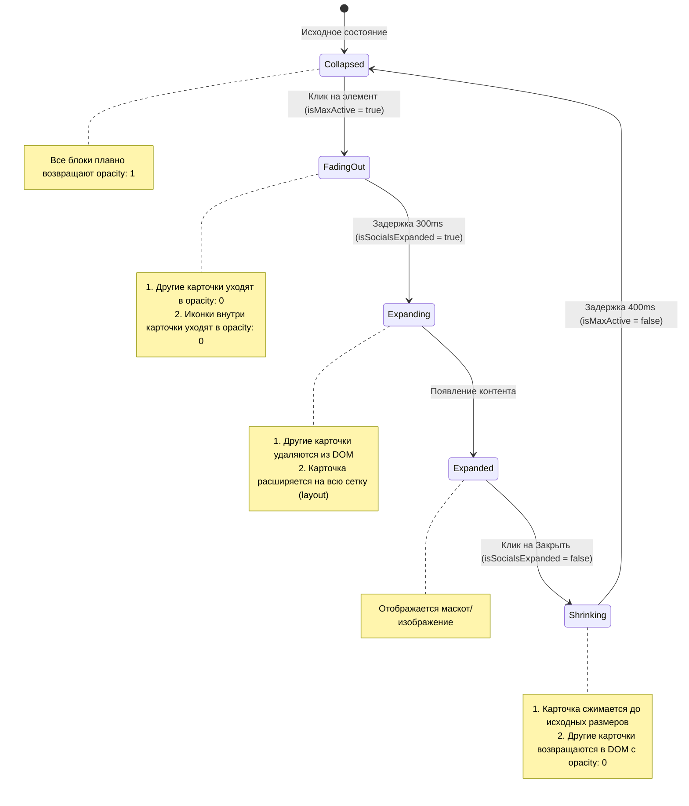

# Методология поэтапной анимации раскрытия блоков (Staged Grid Morphing)

Настоящее руководство описывает паттерн **Staged Grid Morphing (Двухфазное раскрытие блоков)**, разработанный для плавного увеличения элементов внутри CSS Grid без искажения внутреннего контента и скачков макета.

---

## 1. Основные проблемы стандартного подхода

При попытке растянуть блок в сетке (например, задав `grid-column: 1 / span 2`) напрямую через изменение одного флага состояния, возникают две проблемы:
1. **Деформация контента**: Внутренние элементы растягиваемого блока (иконки, кнопки, сетки) начинают непропорционально увеличиваться вслед за родителем до того, как они скроются.
2. **Резкие скачки сетки**: Соседние блоки исчезают мгновенно, ломая плавность перехода, либо карточка увеличивается поверх них с наложением.

---

## 2. Архитектура решения (Двухфазное состояние)

Для достижения идеального UX процесс раскрытия и закрытия разделяется на **две фазы** с помощью независимых флагов состояния:

* `isMaxActive` — управляет **видимостью** контента (прозрачностью).
* `isSocialsExpanded` — управляет **геометрией** блока (сеткой, размерами).



---

## 3. Пошаговая реализация паттерна

### Шаг 1: Настройка родительского компонента (Parent)

Родительский компонент координирует тайминги анимации.

```jsx
// 1. Объявляем двухфазное состояние
const [isMaxActive, setIsMaxActive] = useState(false);
const [isExpanded, setIsExpanded] = useState(false);

// 2. Функция раскрытия (Сначала исчезновение контента, затем расширение геометрии)
const handleOpen = () => {
  setIsMaxActive(true); // Убирает контент
  setTimeout(() => {
    setIsExpanded(true); // Перестраивает сетку
  }, 300); // Тайминг равен длительности анимации исчезновения
};

// 3. Функция закрытия (Сначала сжатие геометрии, затем появление контента)
const handleClose = () => {
  setIsExpanded(false); // Возвращает сетку
  setTimeout(() => {
    setIsMaxActive(false); // Проявляет контент
  }, 400); // Тайминг равен длительности анимации сжатия (layout transition)
};
```

### Шаг 2: Управление сеткой в рендере родителя

Мы используем Framer Motion для автоматической анимации перестроения сетки с помощью пропса `layout`.

```jsx
<div className="grid-wrapper">
  <AnimatePresence>
    {slidesData
      // Отфильтровываем остальные карточки только когда геометрия расширена
      .filter(item => !(isExpanded && item.id !== 'target-card'))
      .map((item) => {
        const isTargetExpanded = isExpanded && item.id === 'target-card';
        const isOtherHidden = isMaxActive && item.id !== 'target-card';

        return (
          <motion.div
            layout // Активирует плавный переход размеров
            key={item.id}
            animate={{ 
              opacity: isOtherHidden ? 0 : 1, 
              scale: isOtherHidden ? 0.95 : 1 
            }}
            transition={{ type: "spring", stiffness: 300, damping: 30 }}
            style={{
              // Увеличиваем блок на всю сетку
              gridColumn: isTargetExpanded ? '1 / span 2' : 'auto',
              gridRow: isTargetExpanded ? '1 / span 2' : 'auto',
              zIndex: isTargetExpanded ? 100 : 'auto',
              pointerEvents: isOtherHidden ? 'none' : 'auto'
            }}
          >
            <CardComponent 
              isMaxActive={isMaxActive}
              isExpanded={isExpanded}
              onOpen={handleOpen}
              onClose={handleClose}
            />
          </motion.div>
        );
      })}
  </AnimatePresence>
</div>
```

### Шаг 3: Настройка дочернего компонента (Child Card)

Дочерний компонент использует пропсы `isMaxActive` и `isExpanded` для своевременного переключения внутреннего содержимого.

```jsx
const CardComponent = ({ isMaxActive, isExpanded, onOpen, onClose }) => {
  return (
    <div className={`card ${isExpanded ? 'expanded' : ''}`}>
      <AnimatePresence mode="wait">
        {isExpanded ? (
          // Фаза B: Развернутый контент
          <motion.div 
            key="expanded"
            initial={{ opacity: 0 }}
            animate={{ opacity: 1 }}
            exit={{ opacity: 0 }}
          >
            <button onClick={onClose}>Закрыть</button>
            
          </motion.div>
        ) : (
          // Фаза A: Сжатый контент (гасится при активации isMaxActive)
          <motion.div 
            key="collapsed"
            initial={{ opacity: 1 }}
            animate={{ opacity: isMaxActive ? 0 : 1 }}
            exit={{ opacity: 0 }}
            transition={{ duration: 0.25 }}
            style={{ pointerEvents: isMaxActive ? 'none' : 'auto' }}
          >
            <button onClick={onOpen}>Открыть</button>
          </motion.div>
        )}
      </AnimatePresence>
    </div>
  );
};
```

### Шаг 4: CSS Специфика

Для исключения сдвигов макета необходимо соблюдать следующие правила:
1. **Сброс паддингов**: При расширении блока, сбрасывайте внутренние отступы родительского контейнера (карточки), чтобы контент развернулся на 100% площади (`padding: 0 !important`).
2. **Адаптивность картинок**: Картинки должны иметь `object-fit: cover` и `border-radius`, совпадающий с радиусом скругления углов карточки, чтобы срез был незаметным.
3. **Блокировка прокрутки**: Во время развернутого состояния глушите внешние обработчики жестов, свайпов или скролла колесика, чтобы предотвратить случайное перелистывание слайдера.

---

> [!TIP]
> При использовании `layout` от Framer Motion всегда проверяйте наличие уникальных `key` у элементов. Применение `AnimatePresence` совместно с `mode="wait"` внутри дочерней карточки гарантирует, что старая сетка иконок полностью исчезнет до того, как карточка начнет менять свои размеры.
